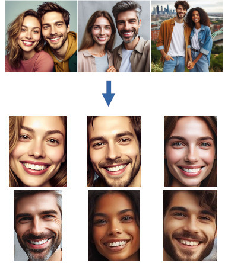
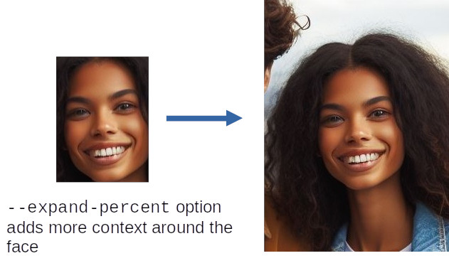
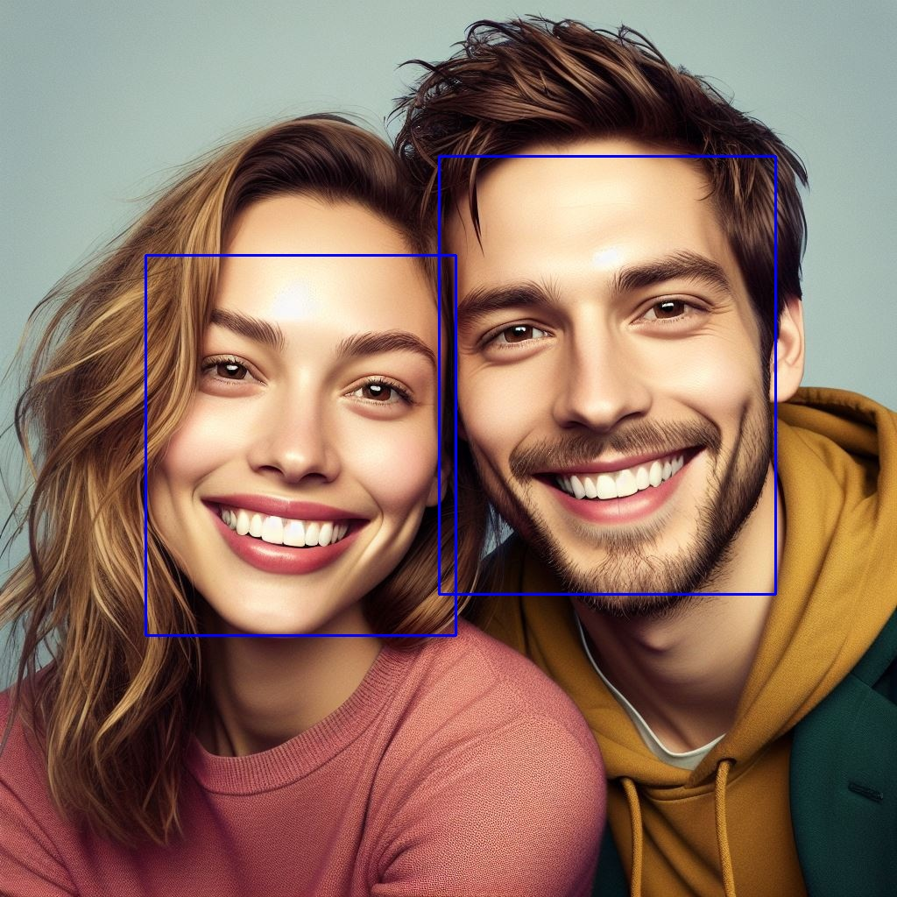

# face-detector

Face detector is a utility for locating faces in photographs. It can:
- Crop out the detected faces
- Provide a JSON file with the coordinates of the detected faces
- List the files that have faces
- Highlight the detected faces with bounding boxes

<p align="center"></p>


Face detector uses a combination of two algorithms to improve face detection performance. Initially it tries a deep neural network approach. A trained model is included. This model generates few false positives but is less suited to large images with faces greater in size than 300x300 pixels. To solve this the image is progressively rescaled and face identification is repeated at each scale until a face is detected. If this approach fails a traditional Haar cascade algorithm is used. This is prone to generating false positives but is more successful with larger faces. To reduce the false positive rate, it blends this approach with the deep neural network to double check the output.

Face detector can be useful for generating AI training data sets. Such data sets also often require duplicate images to be removed to avoid over-training, for which my [photo de-duplication](https://github.com/InexplicableMagic/photodedupe) repo may helpful. It would be recommended to run photodedupe prior to detecting faces.

## Installation

Face detector is written in Python. Simply install the requirements and then run the "face_detect.py" python script.

```pip install -r requirements.txt```

## Usage

To crop out faces found in all photos contained with a directory:

```./face_detect.py input_photos_dir/ --output-dir output_cropped_faces_dir/```

To instead report the locations of faces in **JSON** format:

```./face_detect.py input_photos_dir/ --json```

Each of the detected faces will be quite closely cropped. To include more context around the face use the ```--expand_percent``` option. This accepts an integer which is a percentage expansion around the detected face e.g. this command line will double each width/height dimension (where possible) whilst keeping the face centred. If the face is at the edge of the image, it may not be possible to double the dimensions and the option will produce the largest expansion around the face that it can:

```./face_detect.py input_photos_dir/ --output-dir output_cropped_faces_dir/ --expand-percent 100```

<p align="center"></p>

AI training can require faces with a precisely **square aspect ratio** and a specific size. By default face detector can crop out rectangular regions. To force square images only use ```--square_aspect```. AI training also often requires images of a specific size. To **resize** cropped images use the ```--resize``` option specifying a widthxheight. For example to produce images with a square aspect ration and an exact size of 256x256 pixels specify:

```./face_detect.py input_photos_dir/ --output-dir output_cropped_faces_dir/ --square-aspect --resize 256x256```

Instead of cropping faces, **bounding boxes** can also be drawn on the original image using the ```--highlight``` option e.g:

```./face_detect.py input_photos_dir/ --output-dir output_bounding_boxes_dir/ --highlight```

<p align="center"></p>

Faces below a certain size can also be ignored using ```--min-size``` option, which specifies a width/height below which faces will not be detected.

```./face_detect.py input_photos_dir/ --output-dir output_cropped_faces_dir/ --min-size 100x100```

Files that contain faces can also be listed on stdout. This is useful for piping a list of images that contain at least one face to another command e.g. to move all of the images that contain at least one face to another directory:

```./face_detect.py input_photos_dir/ --file-list | xargs -i mv "{}" directory_of_images_with_faces/```
